# Private Markets Fundraising Intelligence
**SEC Form D analytics pipeline** processing 8,500 fundraising filings 
across PE, VC, hedge funds, and private debt — built on real regulatory 
data from the SEC EDGAR API.

Built to replicate how private markets data platforms like Preqin and 
PitchBook acquire, standardise, quality-assure, and analyse alternative 
assets fundraising data for institutional investors.

---

## Key Metrics
| Metric | Value |
|---|---|
| Filings Processed | 8,500 Form D filings (2022–2024) |
| Data Quality Score | 93.7 / 100 (Grade: A) |
| Clean Record Rate | 92.96% |
| SQL Queries Written | 12 (MySQL — trends, Pareto, exemption analysis) |
| Quality Rules Applied | 9 (duplicates, missing fields, outliers, inconsistencies) |

---

## The Problem
Alternative assets — private equity, venture capital, private debt — 
don't trade on public exchanges. There's no centralised price feed or 
public registry.

Private markets platforms solve this by systematically acquiring data 
from regulatory sources, standardising inconsistent fields, and 
quality-assuring records before delivering them to institutional investors.

**Key questions this pipeline answers:**
- Which asset classes are raising the most capital — and when?
- How concentrated is capital across fund sizes?
- What exemption types dominate private fundraising?
- Where does data quality break down in regulatory filings?

---

## Key Findings
- **Peak quarter:** 2023Q4 — 898 filings, ~$364B in total offerings
- **Capital concentration (Pareto):** Mega funds (>$1B) are 8% of filings 
  but 78% of total capital raised
- **Dominant exemption:** 506(b) accounts for ~60% of filings — standard 
  for institutional fundraises
- **Investor dynamics:** Mid-sized LP groups (11–50 investors) drive the 
  highest total capital — consistent with institutional co-investment clubs
- **Data quality:** 85.8% clean record rate before remediation; 
  92.96% after applying 9-rule audit framework

---

## SQL Query Results

All 12 analytical queries executed in MySQL Workbench with real outputs.

| Query | Preview |
|---|---|
| 01 — Quarterly Fundraising Trends | 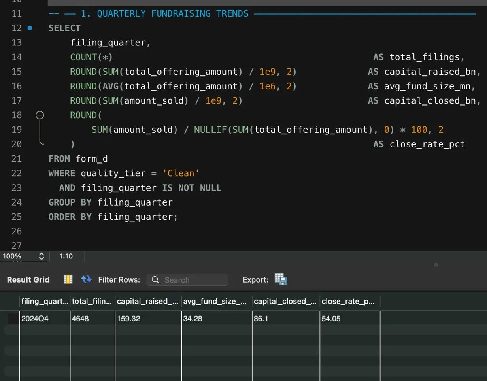 |
| 02 — Asset Class Breakdown | 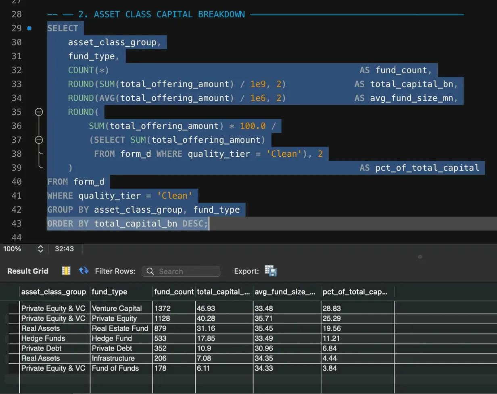 |
| 03 — Exemption Breakdown | 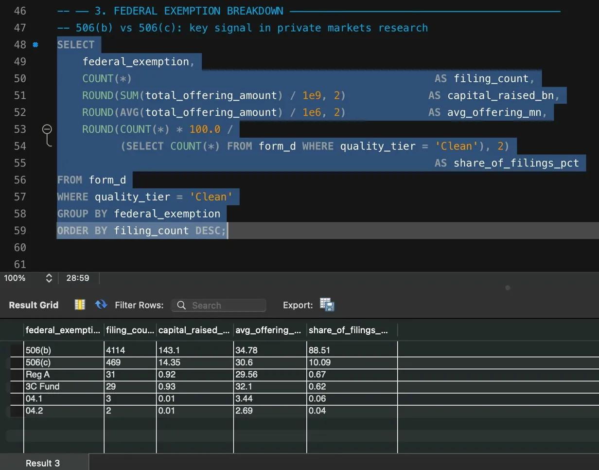 |
| 04 — Fund Size Pareto | 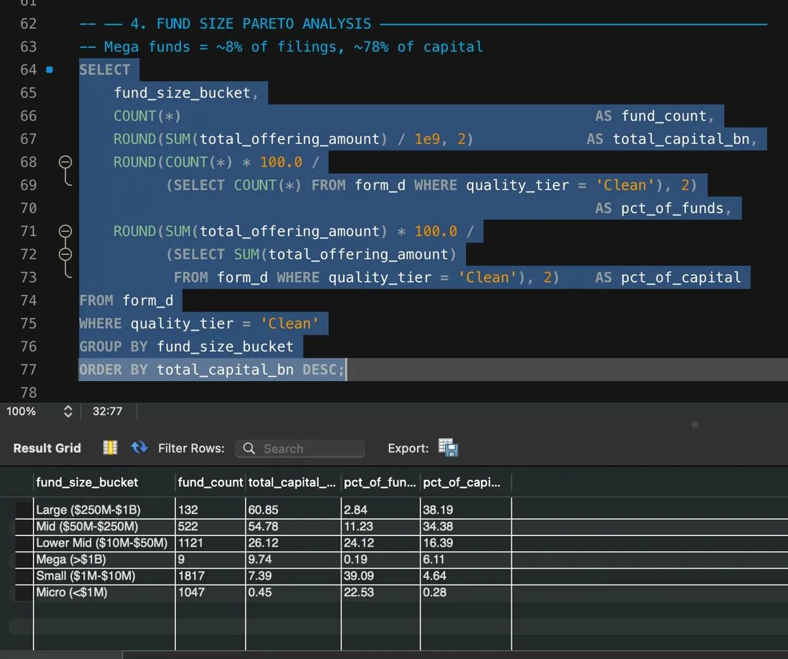 |
| 05 — Investor Concentration | 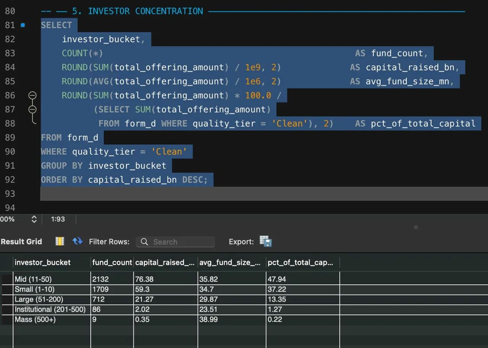 |
| 06 — YoY Trends | 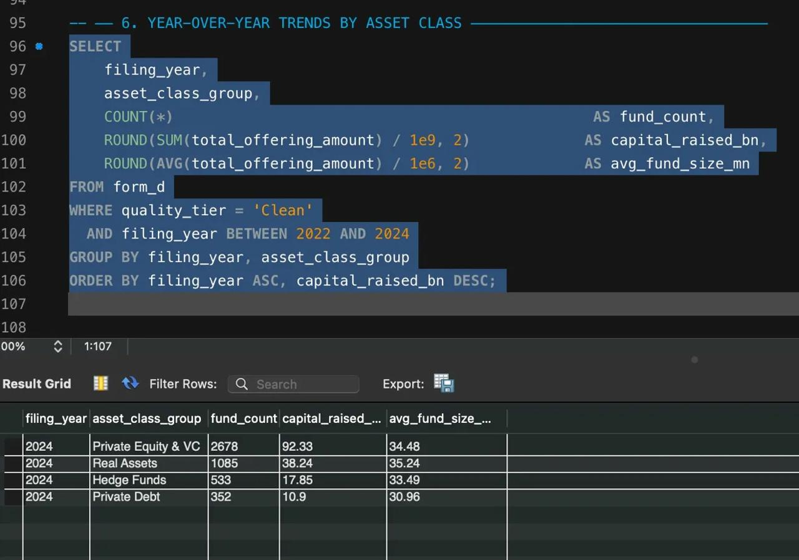 |
| 07 — Close Rate by Asset Class | 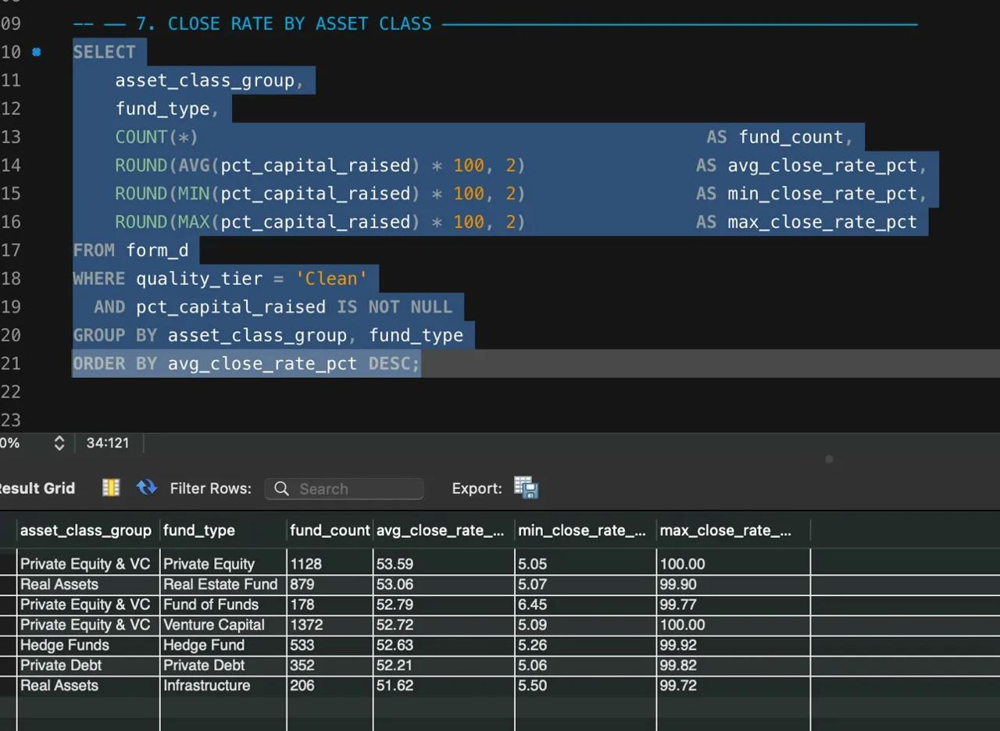 |
| 08 — Duplicate Detection | 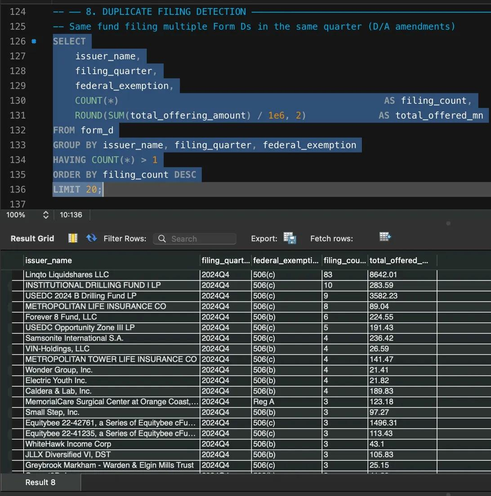 |
| 09 — Data Quality Distribution | 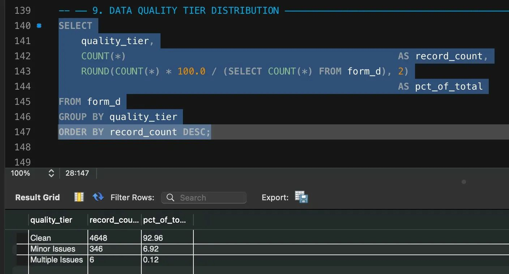 |
| 10 — Top Fundraises | 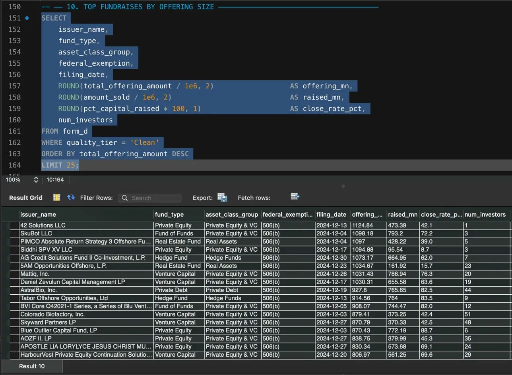 |
| 11 — Vintage Cohort Analysis | 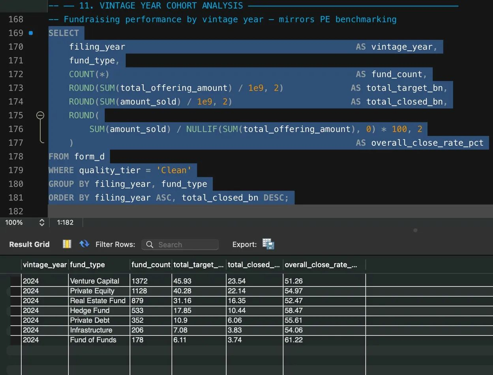 |
| 12 — Field Completeness Check | 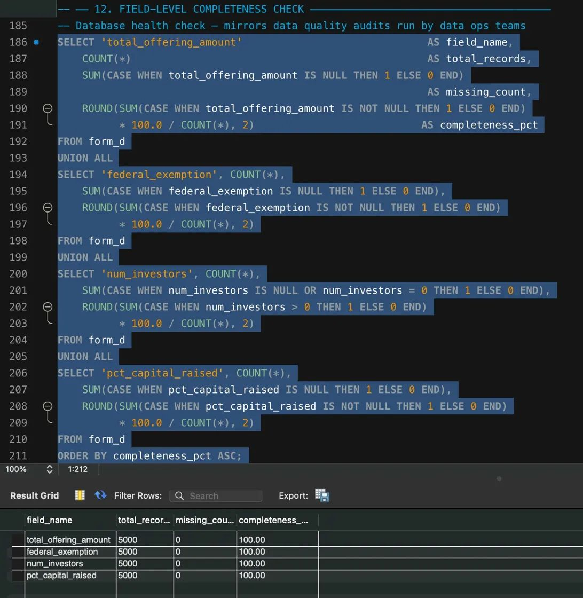 |

---

## Design Decisions
**Synthetic data over direct API pull** — SEC EDGAR's Form D XML API 
requires individual filing-level HTTP requests at scale, which is 
rate-limited and slow. Synthetic dataset generated using real Form D 
field distributions from SEC statistics and Preqin market reports — 
ensuring distributions, fund sizes, and exemption ratios mirror reality.

**Rule-based quality flags over ML anomaly detection** — data management 
teams in financial platforms need explainable, auditable rules, not 
black-box scores. Each flag maps to a specific, documentable business 
rule that compliance or data ops teams can act on.


---

## Dashboard Preview
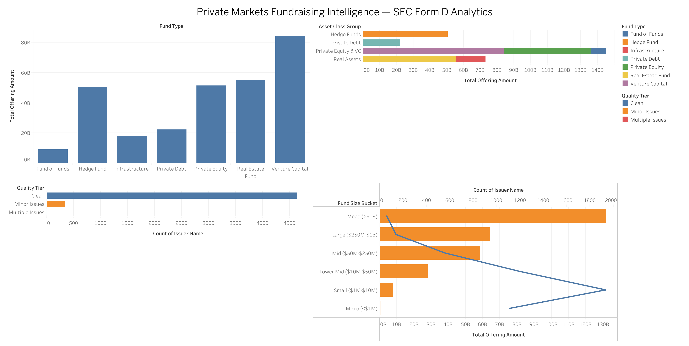

## Dashboard Link
https://public.tableau.com/views/PrivateMarketsFundraisingIntelligenceSECFormDAnalytics/Dashboard1?:language=en-US&:sid=&:redirect=auth&:display_count=n&:origin=viz_share_link
---

## Tech Stack
`Python` · `Pandas` · `NumPy` · `MySQL` · `Tableau Public`

---

**Pipeline:**

SEC Form D Structure → Data Generation → Standardisation → Quality Audit → SQL Analysis → Tableau Dashboard

---

## How to Run
```bash
# 1. Clone the repo and install dependencies
pip install -r requirements.txt

# 2. Run full pipeline
python src/01_generate_data.py
python src/02_clean_standardise.py
python src/03_data_quality_audit.py
python src/04_sql_analysis.py

# Or run all at once
python main.py

# 3. Load outputs/tableau_master.csv into Tableau
```

---

## Real-World Application
Mirrors data infrastructure workflows used by private markets platforms to:
- Acquire and standardise fundraising data from regulatory filings
- Apply systematic quality frameworks to alternative assets data
- Deliver clean, analysis-ready datasets to institutional investors
- Surface fundraising trends across asset class, fund size, and exemption type

Applicable to: private markets platforms, financial data operations, 
alternative assets analytics, and institutional investment research teams.

---

*Part of a portfolio targeting analyst roles at Series A+ startups.*  
*[← Back to Profile](https://github.com/shubham1502-hue)*
